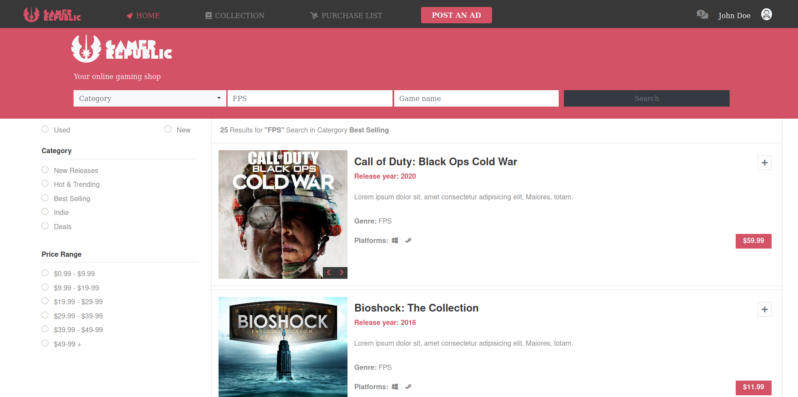

# Capstone Project

This is the Capstone Project of the HTML &amp; CSS module of the main curriculum of Microverse, and it aims to create an online game shop, inspired on the design created by [Mohammed Awad](https://www.behance.net/gallery/24796463/ZATTIX).
In this project there are 2 pages: the first one is the main page, it displays some of the recommended games for different categories as well as the hot games of the week; the second page is the result search page (reachable when clicking on the search button), and it displays the main results for the FPS genre.

> The Main Page :
 


> The Search Results :



## Built With

- HTML 
- CSS 
- Bootstrap as Framework

## Video Preview


[](https://www.loom.com/share/466877d1feb44a70ac3a13d1b0a5e5d4)

## Live Demo

[Live Demo Link](https://raw.githack.com/VanessaAoki/CapstoneProject/feature_main/index.html) 


## Getting Started

To get a local copy up and running follow these simple example steps.

### Prerequisites

- Any internet browser (Firefox, Google Chrome, Opera...)

or 

- Live Server plugin for Visual Studio Code 

### Setup #1


1 - Download the code or copy the repository to your computer

2 - Run the index.html file


### Setup #2


1- Clone the repository
```
 $ git clone https://github.com/VanessaAoki/CapstoneProject.git
```

2- Open the folder on VS Code, right-click the index.html file and click on "Open With Live Server"


## Author

👤 **Vanessa Aoki**

- GitHub: [@VanessaAoki](https://github.com/VanessaAoki)
- Twitter: [@VanessaSAoki](https://twitter.com/VanessaSAoki)
- Linkedin: [Vanessa Aoki](https://www.linkedin.com/in/vanessasaoki/)

## 🤝 Contributing

Contributions, issues, and feature requests are welcome!

Feel free to check the [issues page](https://github.com/VanessaAoki/CapstoneProject/issues)

## Show your support

Give a ⭐️ if you like this project!

## 📝 License

This project is [MIT](https://github.com/VanessaAoki/CapstoneProject/blob/feature_main/LICENSE) licensed